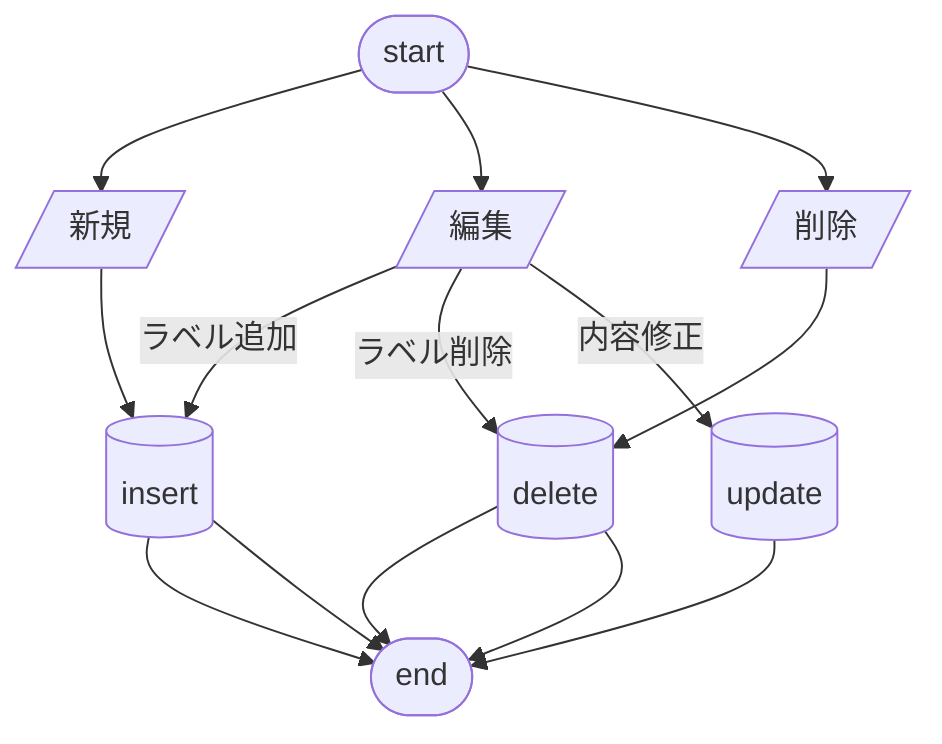

# test

```mermaid
flowchart TD
    START --> NEW[/新規/] --> INSERT(insert) --> END
    START --> MOD[/編集/]
    START --> D[/削除/] --> DELETE -->END

    MOD -->|ラベル追加| INSERT --> END
    MOD -->|ラベル削除| DELETE --> END
    MOD -->|内容修正| UPDATE --> END

    START([start])
    INSERT[(insert)]
    UPDATE[(update)]
    DELETE[(delete)]
    END([end])
```
